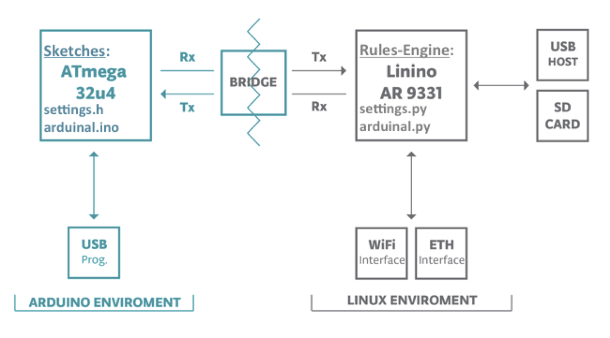

Copyright (c) 2014 Kamesh Raghavendra

This application observes ambient temperature & intelligently notifies anomalies

Requires Arduino Yun, OpenWRT 1.3+, SD card, temperature sensor

There are two components to this application:
sketches: This runs in the ATmega32u4 side of the bridge, reports temperature changes
rules-engine: This runs in the AR9331 OpenWRT Linux side of the bridge, detects anomalies in temperature

The application is currently configured to use InfluxDB for storing time-series data

Refer to [INSTALL](INSTALL) for installation intructions

See sample Twitter notifications [here](https://twitter.com/arduinal)

See sample time-series visualization [here](http://54.255.180.1/grafana-1.8.0-rc1/#/dashboard/db/arduinal-temperature)
